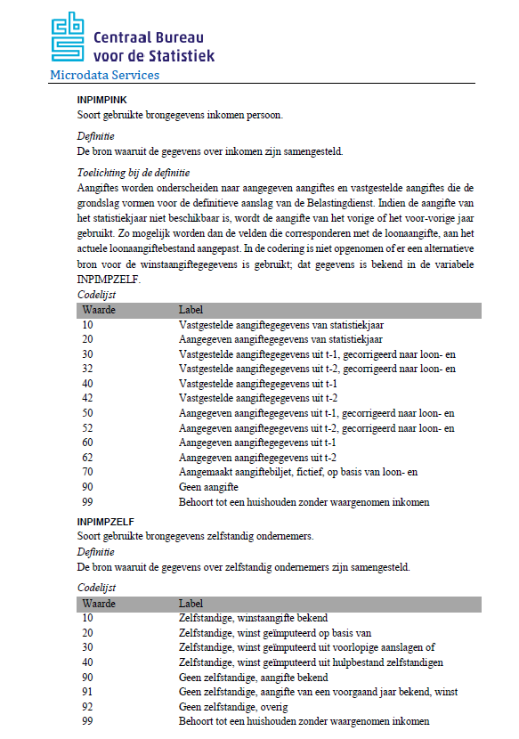
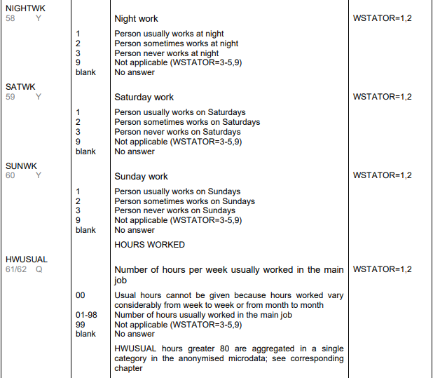

```{r setup, include=FALSE}
# Load packages -----------------------------------------------------------
# Package names
packages <- c( "data.table", "here", "tidyverse", "highcharter", "data.table","revealjs","tools", "patchwork")

# Install packages not yet installed
installed_packages <- packages %in% rownames(installed.packages())
if (any(installed_packages == FALSE)) {
  install.packages(packages[!installed_packages])
}

# Packages loading
invisible(lapply(packages, library, character.only = TRUE))

# Provide a source file  -----------------------------------------------------------
source(here('scripts', 'tips.R'))


# Knitting options ----------------------------------------------
options(htmltools.dir.version = FALSE)
knitr::opts_chunk$set(
  fig.width=5, fig.height=3, fig.retina=3,
  out.width = "100%",
  cache = FALSE,
  echo = TRUE,
  message = FALSE, 
  warning = FALSE,
  hiline = TRUE
)


# Read in the data files 
lfs <- readr::read_csv(here('data' , "dummy_LFS.csv"))
```

```{r htmlTemplate, echo=FALSE, out.width = "40%"}
# Create the external file
img <- htmltools::img(src = knitr::image_uri(here("assets", "img", "logo.png")), 
               alt = 'logo', 
               style = 'position:absolute; top:10px; right:1%; padding:10px;z-index:200;',
               width = '150',
               height = '150'
               )

htmlhead <- paste0('
<script>
document.write(\'<div class="logos">',img,'</div>\')
</script>
')

readr::write_lines(htmlhead, path = "header.html")
```

# TIP 1: Prepare your environment 

- Setup RStudio
- Load packages
- Use relative paths

## Setup R studio

  - Create a project: `File->New Project->New Directory->New Project`  
  - Create folder structure
  - Create first script: `File->New File->RScript->Save in scripts folder` 
{height=300px}

<font size="3">*Source*: [Data Carpentry: R for Social Scientists](https://datacarpentry.org/r-socialsci/00-intro/index.html#getting-set-up)</font>
  
## Load packages 
```{r load-pkg, eval=F}
# Load packages -----------------------------------------------
 library("data.table")
 library("here")
 library("tidyverse")
 library("tools")
```
```{r load-pkg2 , eval=F}
# Load packages -----------------------------------------------
# Package names
packages <- c( "data.table", "here", "tidyverse",
               "highcharter", "data.table",
               "revealjs","tools")

# Install packages not yet installed
installed_packages <- packages %in% rownames(installed.packages())
if (any(installed_packages == FALSE)) {
  install.packages(packages[!installed_packages])
}

# Packages loading
invisible(lapply(packages, library, character.only = TRUE))
```

## Choose relative paths!
Do not set absolute paths with `set_wd()`. `here()`package absolute path given current working directory.

```{r here-pkg}
here()
here('data')
here('data', 'dummy_LFS.csv')
```

# TIP 2: Generalise your code 
- Create functions
- Avoid hard-coding, assign values to objects 
- Avoid repetition, use e.g.:
  - `for` loops
  - `apply()` family functions
  - `map()` and `map2()` family functions()

## Functions

```{r function-syntax}

my_function <- function(arg1, arg2, arg3=0) {
    x <- arg1 + arg2
    x
}

my_function(1,2)

```

## Functions
You can customise your function for your purpose or further generalise it further:
```{r function-example1, eval=F }
###### Function to join the 2 tables
join_tabs <- function(p_tab, hh_tab){
   single_tab <- left_join(p_tab, hh_tab, 
                           by=c("RINPERSOON" = "RINPERSOON"))
   
   return(single_tab)
}

single_tab <- join_tabs(p_tab, hh_tab)

```
```{r function-example3, eval = F}
###### Function to join the 2 tables
join_tabs <- function(p_tab, hh_tab, key = "RINPERSOON"){
   single_tab <- left_join(p_tab, hh_tab, by=c(key = key))
   return(single_tab)
}

single_tab <- join_tabs(p_tab, hh_tab)

```

## (l)apply() it

```{r apply, eval = F}
#### lapply()
new_list <- lapply(old_list, function)

#### map2()
new_df <- map2_dfr(object1, object2, function )

#### mapply()
new_df <- mapply(function,arg1 = object1, arg2= object2,  SIMPLIFY=F ) %>% as.data.frame()


```


## Create objects!
This will help you changing your code only in one place, rather than everywhere you used the value.
```{r object}
text1<-paste('Today, I have run 10.2 km. 10.2 km is 12000 m. It was a good result.')
print(text1)

today<-Sys.Date()
distance <- 10.2 
text2<- paste0('On ', today,', I have run ', distance ,'km. '
              , distance , 'km is ', distance*1000,'m. It was a '
              , ifelse(distance>=10, 'good','bad'),' result.')

print(text2)
```

## Avoid repetition
```{r file-list}
# Get file names of all our files
data_path = here('data')
files = here(data_path, dir(data_path))
```
```{r manual}
# Read in first rows of each data.frame
data1 <- fread(files[1])
data2 <- fread(files[2])
```
```{r for-loop, eval=F}
# Read first rows of each data.frame
file_list = list()

for (i in files) { 
  file_list[[i]] == fread(i)
}
```
```{r lapply}
# Read first rows of each data.frame
file_list2 = lapply(files, fread )
```

# TIP 3: Read(write) data documentation  
In some case (like with CBS data), although you cannot access the data, you can already access the documentation. 

If you are collecting data, it's a good moment to create your data model and start writing documentation 

## E.g.: [CBS](https://www.cbs.nl/-/media/cbs-op-maat/microdatabestanden/documents/2022/17/inpatab.pdf)


{height=600px}

## E.g.: [EULFS](https://ec.europa.eu/eurostat/documents/1978984/6037342/EULFS-Database-UserGuide.pdf)


 

## Create metadata object
Create a metadata data frame with info about the variables you are going to use.
It can include fields: 

- Names of variables
- Variable labels
- Variable preferred data type (factor/numeric/date/(...))
- Variable data type in the dataset
- Coding of missing values 
- Possible values
- (...)

## Create metadata object
```{r metadata-table}
meta_table = data.table::data.table(
  var_name = c('NIGHTWK', 'SATWK', 'SUNWK', 'HWUSUAL'),
  var_label = c('Night work', 'Saturday work',
                'Sunday work', 'Hours worked'),
  pref_dtype = c('factor', 'factor', 'factor', 'numeric'),
  dset_dtype = c('numeric', 'numeric', 'numeric', 'numeric'),
  missing = list(c('9',''), c('9',''), c('9',''), c('00','99','')),
  possible_values =list(1:3, 1:3, 1:3, 1:98) 
  )

print(meta_table)

```

# TIP 4: Prepare to read data 
- Prepare script to read the data
- Create dummy data 

## Prepare for a single file
```{r read-data1 }
my_data <- read_csv(here('data','dummy_LFS.csv'))
```

## Get all the files from data directory
```{r read-data2 }
data_path = here('data')
files = here(data_path, dir(data_path))
files_no_ext = tools::file_path_sans_ext(files)
```

Custom for certain file paths (e.g. csv)
```{r read-data3 }
file_list_1 = lapply(files, read_csv)
```

Generalize (data.table output)
```{r read-data4 }
file_list_2 = lapply(files, fread)

# Get the first dataset 
data1 <- file_list_2[[1]]
nrows_1 <- nrow(data1)
```

```{r head-data}
head(data1)
```

## Prepare a dummy dataset
- Manually

```{r dummy-data}
# Number of rows to generate
n_rows <- 10000

# Set seed to always get the same result in PRNGs  
set.seed(12345)

# Generate the data frame
dummy_data <- data.frame(
  ID = 1:n_rows,
  NIGHTWK = sample(as.numeric(c(1,2,3,9,'')),n_rows,rep=T),
  SATWK = sample(as.numeric(c(1,2,3,9,'')),n_rows,rep=T),
  SUNWK = sample(as.numeric(c(1,2,3,9,'')),n_rows,rep=T),
  HWUSUAL = sample(as.numeric(c(0:99,'')),n_rows,rep=T)
  )

```

## Prepare a dummy dataset
- From a metadata file
```{r dummy-data2}
### Create variable with all possible values of a variable
meta_table$all_values <- mapply(c, meta_table$missing, meta_table$possible_values, SIMPLIFY = FALSE)

### Character vector of function names to adapt the data type
funs <- paste0("as.", meta_table$dset_dtype)

### Change the data type so that it's aligned with the documentation
meta_table[,all_values:= mapply(function(arg,f) f(arg),
                   meta_table$all_values, 
                   lapply(funs, get),
                   SIMPLIFY = F)]

### Number of rows to generate
n_rows <- 10000

### Set seed to always get the same result in PRNGs  
set.seed(12345)

### Sample 10,000 data points from all possible values
dummy_data2 <- lapply(meta_table$all_values, 
                      sample, n_rows, rep=T) %>% as.data.table()

#Name the variables
colnames(dummy_data2) <- meta_table$var_name

# Add ID variable
dummy_data2[, ID:= 1:n_rows]

# Reorder vars
setcolorder(dummy_data2, c('ID', meta_table$var_name))

```


## And use it to automate cleaning 
Remove NA
```{r automate-na}
# Remove NAs different on variable-specific codes
### Convert a certain character to NA
recode_to_na <- function(x, char){
  out_x <- x
  out_x[which(out_x %in% char)] = NA
  return(out_x)
}

### Check if all the columns are there
check_data_cols <- function(real_data, meta_vars){
  real_names <- names(real_data)
  n_real_names <- length(real_names)
  n_meta_names <- length(meta_vars)
  n_real_meta <- sum(real_names %in% meta_vars)
  n_meta_real <- sum(meta_vars  %in% real_names)
  
  text1 <- paste0(n_real_names - n_real_meta , ' variables not covered in the metadata list:')
  text2 <- paste0(n_meta_real, ' out of ', length(meta_vars) , ' metadata covered' )
  
  paste(text1,
  paste(real_names[!(real_names %in% meta_vars)], sep=', '),
  ';',
  text2
  )
  }
#check_data_cols(dummy_data2, meta_table$var_name )

### Keep only the variables from the metadata 
meta_var <- meta_table$var_name
dummy_data_clean <- dummy_data2[,..meta_var]

### see the first 10 rows
#head(dummy_data_clean,10)


### Keep only the vars that we chose in the metadata file
dummy_data_clean<-map2_dfr(dummy_data_clean,meta_table$missing, recode_to_na )

### see the first 10 rows
#head(dummy_data_clean,10)
```

## And use it to automate cleaning 
Adapt data types 
```{r automate-types, eval=F}
### Vector of function names to change data types 
funs <- paste0("as.", meta_table$pref_dtype)

# ## Correct data.table syntax
# dummy_data_clean <- as.data.table(dummy_data_clean)
# vars <-meta_table$var_name
# 
# dummy_data_clean[ , c(vars) := mapply(function(a,b) b(a),
#                                       .SD,
#                                       lapply(funs, get),
#                                       SIMPLIFY=F ),
#                   .SDcols = vars ]


### Convert all the columns in the data set to the preferred data type 
dummy_data_clean <- as.data.table(mapply(function(a,b) b(a), 
                                         dummy_data_clean, 
                                         lapply(funs, get), 
                                         SIMPLIFY = F))


#str(dummy_data_clean)


```

# TIP 5: Prepare for data vises
- Choose (and adapt) your [theme](https://r-charts.com/ggplot2/themes/)
- Choose or create your color palette
- Create your custom functions

## Choose and adapt your theme
Default ggplot
```{r ggplot-default}
plot_iris<-function(){
  p1 <- ggplot(iris, aes(Sepal.Length,Sepal.Width, color = Species))+
    geom_point()
  
  p2 <- ggplot(iris, aes(Sepal.Length,Sepal.Width,  color = Sepal.Width))+
    geom_point()
  
  #Compose plot
  p3 <- p1|p2
  
  return(p3)

}

plot_iris()

```


## Choose and adapt your theme 
```{r choose-theme}
dcc_theme <- theme_minimal() + 
  theme(panel.grid.major.x = element_blank(),
        axis.title = element_blank(),
        text = element_text(color = 'gray60'),
        axis.text = element_text(color = 'gray20'),
        legend.position="bottom"
        )

theme_set(dcc_theme)

```

## Choose and adapt your theme 
```{r plot-new-theme}
plot_iris()
```


## Choose or create your color palette
- Use [pre-made palettes](https://r-graph-gallery.com/ggplot2-color.html#:~:text=CHANGING%20THE%20COLOR%20SCALE%20WITH%20GGPLOT2), e.g. from `viridis()`
- Or save your own selection of colors in a vector
- Inspect color palettes with `scales::show_col()`
- Change ggplot default colors with `options()`
 
## Choose or create your color palette 
- Use [pre-made palettes](https://r-graph-gallery.com/ggplot2-color.html#:~:text=CHANGING%20THE%20COLOR%20SCALE%20WITH%20GGPLOT2), e.g. from `viridis()`
- Or save your own selection of colors in a vector
```{r own-colors}
tud_cols  <- c('#00A6D6','#FFFFFF', '#000000', '#0C2340', '#00B8C8'  )
cols_cont <- viridis::viridis(20)
tud_qual  <- c('#00B8C8', '#EC6842', '#FFB81C', '#EF60A3' )

```

## Choose or create your color palette
- Inspect color palettes with `scales::show_col()`
```{r own-colors2 ,out.width = "40%"}
scales::show_col( tud_cols  ); scales::show_col( cols_cont  )
```

## Choose or create your color palette
- Change ggplot default colors with `options()`
```{r own-colors3}
opts <- options()  # save old options

options(ggplot2.continuous.colour="viridis")
options(ggplot2.continuous.fill = "viridis")

options(ggplot2.discrete.colour=tud_qual)
options(ggplot2.discrete.fill = tud_qual)

```

## Choose or create your color palette 
```{r plot-new-cols}
plot_iris()
```  
  
  
## Create your custom functions 
```{r custom-function}
###### Function to visualise the distribution of birthday months
viz_birth_month <- function(single_tab){
  
  levels(single_tab$GBAGEBOORTEMAAND) <- c(
    "January","February", "March", "April", 
    "May", "June", "July", "August",
    "September", "October", "November", "December"
    )
  
  q <- ggplot(data=single_tab, aes(x=GBAGEBOORTEMAAND)) + 
    geom_bar(fill="orange") + 
    ggtitle("Distribution of birthdays by month in register population") +
    coord_flip() + 
    scale_x_discrete(limits = rev(levels(single_tab$GBAGEBOORTEMAAND))) +
    theme_minimal()
  return(q)
}
```


    
# TIP 6: When you get the data ...
- Store the data in the right location (e.g. `data/` folder)
- See the data structure with: `summary()` or `str()`
- See if the the data you need is there (confront with metadata file?)
- Do initial data cleaning, e.g.:
  - Recode NAs
  - Remove white spaces
  - Recode 
  - Check and adapt data types
  - Make sure dates are read in the right format (try `lubridate()`)
   
# Example : CBS data 
Let's do some coding

# Discussion
Questions? 
Comments? 
Your own examples?


# Next R Cafe 


