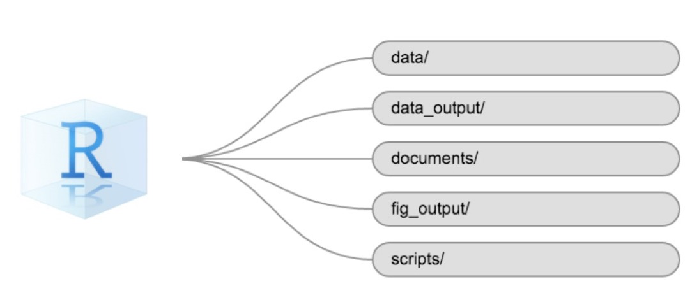
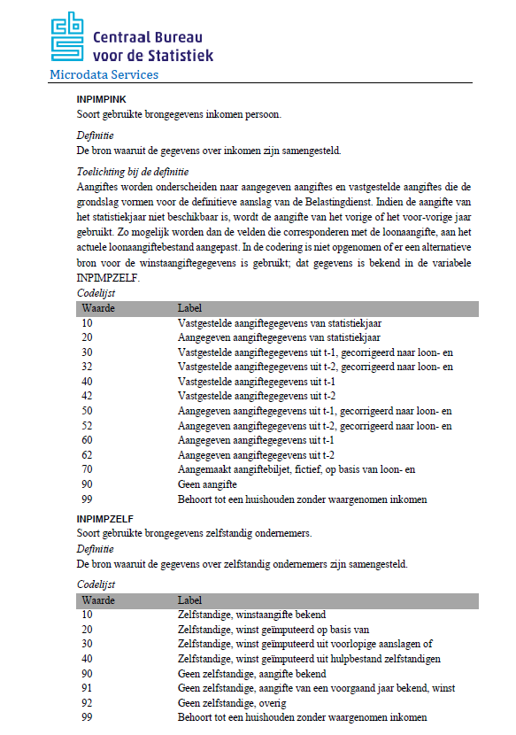

```{r setup, include=FALSE}
# Load packages -----------------------------------------------------------

# Package names
packages <- c( "data.table", "here", "tidyverse", "highcharter", "data.table","revealjs")

# Install packages not yet installed
installed_packages <- packages %in% rownames(installed.packages())
if (any(installed_packages == FALSE)) {
  install.packages(packages[!installed_packages])
}

# Packages loading
invisible(lapply(packages, library, character.only = TRUE))

# Provide a source file  -----------------------------------------------------------
source(here('scripts', 'tips.R'))


# Knitting options ----------------------------------------------
options(htmltools.dir.version = FALSE)
knitr::opts_chunk$set(
  fig.width=9, fig.height=5, fig.retina=3,
  out.width = "100%",
  cache = FALSE,
  echo = TRUE,
  message = FALSE, 
  warning = FALSE,
  hiline = TRUE
)


# Read in the data files 
lfs <- readr::read_csv(here('data' , "dummy_LFS.csv"))
```


# TIP 1: Create RStudio project: 


`File -> New Project -> New Directory -> New Project`


## & a folder structure



<font size="3">*Source*: [Data Carpentry: R for Social Scientists](https://datacarpentry.org/r-socialsci/00-intro/index.html#getting-set-up)</font>


# TIP 2:  Don't use absolute paths 
{height=500px}

<font size="3"> *Credit*:[Allison horst](https://github.com/allisonhorst)</font>


## Choose relative paths!
{height=500px}

<font size="3">*Credit*:[Allison horst](https://github.com/allisonhorst)</font>


# TIP 3: Read the data documentation  
E.g.: [CBS](https://www.cbs.nl/-/media/cbs-op-maat/microdatabestanden/documents/2022/17/inpatab.pdf)

{height=500px}

## TIP 3: Read the data documentation 
E.g.: [EULFS](https://ec.europa.eu/eurostat/documents/1978984/6037342/EULFS-Database-UserGuide.pdf)

 

## ... and make use of it
- Create a metadata data frame with info about the variables you are going to use
- It can include fields: 
  - Names of variables
  - Variable labels
  - Variable preferred data type (factor/numeric/date/(...))
  - Variable data type in the dataset
  - Coding of missing values 
  
## ... and make use of it

```{r metadata-tibble, echo = T}

meta_tibble = tibble::tibble(
  var_name = c('NIGHTWK', 'SATWK', 'SUNWK', 'HWUSUAL'),
  var_label = c('Night work', 'Saturday work', 'Sunday work', 'Hours worked'),
  pref_dtype = c('factor', 'factor', 'factor', 'numeric'),
  dset_dtype = c('numeric', 'numeric', 'numeric', 'numeric'),
  missing = list(c('9',''), c('9',''), c('9',''), c('00','99',''))
  )

print(meta_tibble)

```


## ... and make use of it

```{r metadata-table, echo = T}

meta_table = data.table::data.table(
  var_name = c('NIGHTWK', 'SATWK', 'SUNWK', 'HWUSUAL'),
  var_label = c('Night work', 'Saturday work', 'Sunday work', 'Hours worked'),
  pref_dtype = c('factor', 'factor', 'factor', 'numeric'),
  dset_dtype = c('numeric', 'numeric', 'numeric', 'numeric'),
  missing = list(c('9',''), c('9',''), c('9',''), c('00','99',''))
  )

print(meta_table)

```

# TIP 4: Read metadata to an object

```{r}
data_path = here('data')
files = here(data_path, dir(data_path))
files_no_ext = gsub('\\.[[:alnum:]]+$', '', files)


# Data.table
file_list = lapply(files, fread)

# Tidyverse
file_list = lapply(files, ) 


```


# Create functions 

to apply on entire dataset or data parts

# Make use of lapply/apply 

# Prepare for data vises

# When you get the data ...

# Example : CBS data 

# Discussion